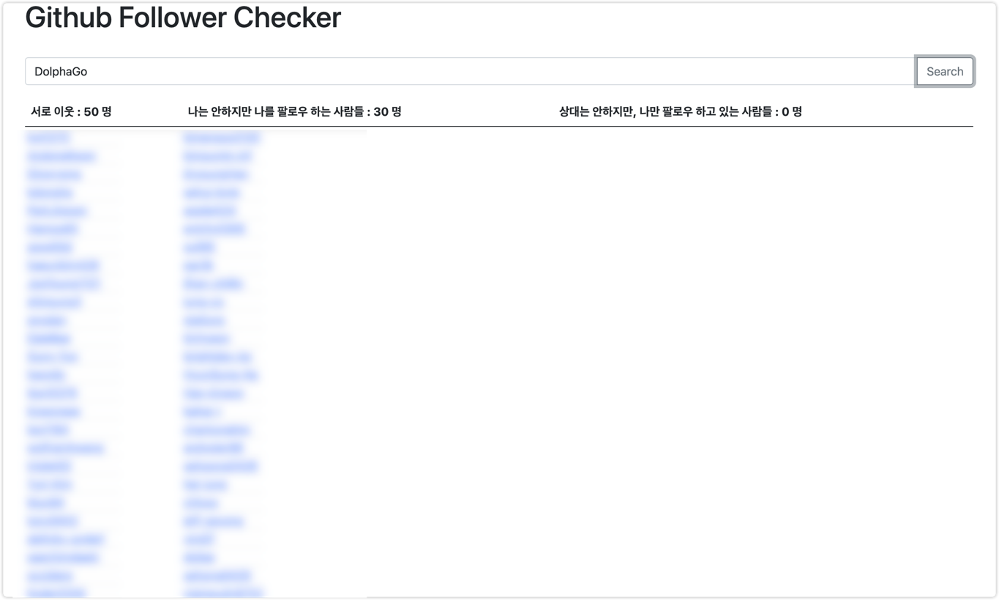

# 😉You can check your Github Following & Follower!

### Aren't you curious about who is following you or who are you following?🤔

### I have a follow/unfollow check service on Instagram, but it's not on GitHub, so I just made it for fun.

### It is very Simple. All you have to do is type `your GitHub handle`.
Just Try `Run Server` and type `http://localhost:8080/check?handle={your github handle}` on your browser.

You can look this infomation.
1. each other's neighbors
2. Someone who's following you(not you)
3. Someone you are following(not the him)

Also, you can use this application as batch application(For Tracking)
- VM Option : `-Dspring.batch.job.names=checkFollowJob`
- ProgramArguments : handle = `{your github handle}` ex) handle=DolphaGo

## Version

* Java : 11
* Spring Boot : 2.4.3
* Build Tool : Gradle

## Demo

