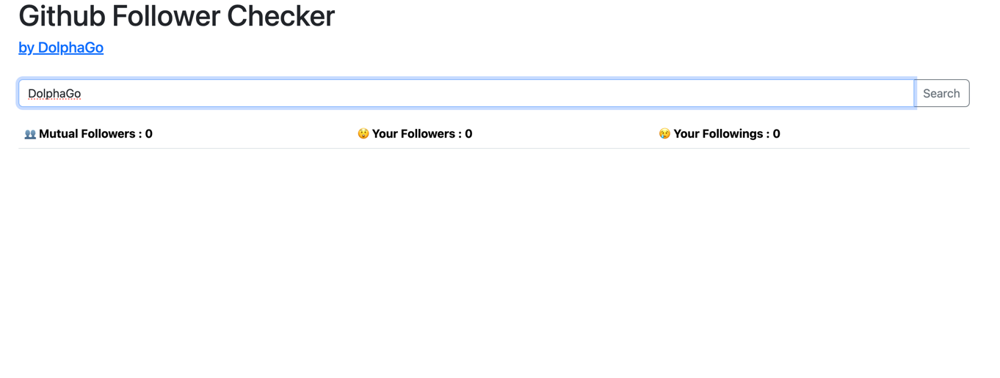
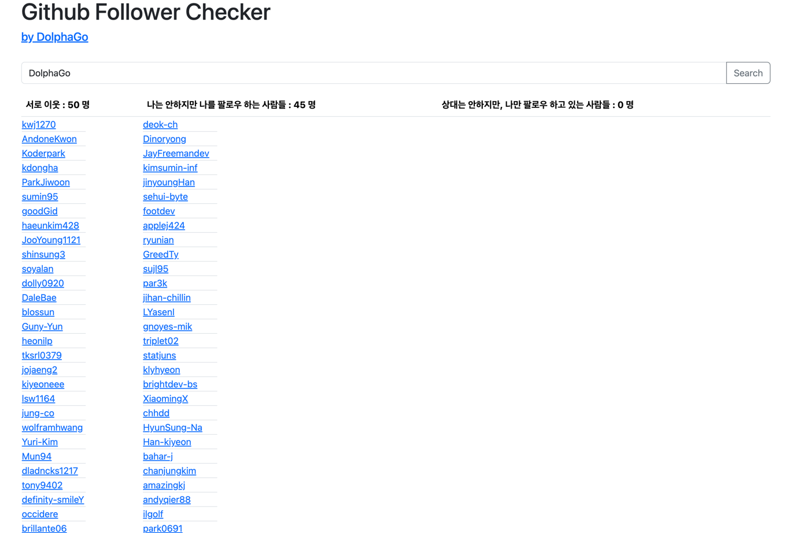

# 😉 Check Your GitHub Following & Follower!

### 🎯 Try it Now! 👉 [Demo Test](http://dolphago.ga)

---

## 🔍 Curious about who is following you or who you are following? 🤔

There are many follow/unfollow check services for Instagram, but not for GitHub.  
So, I created this just for fun! 🎉

---

## 🚀 How to Use
It's super simple! Just enter **your GitHub handle** and check the details.

1️⃣ **Run the Server**  
2️⃣ Open your browser and visit: http://localhost:8080/check?handle={your_github_handle}  
3️⃣ See the details:
- **Mutual Followers** (Each other's neighbors 👥)
- **Your Followers** (People who follow you but you don’t follow back 😲)
- **Your Followings** (People you follow but don’t follow you back 😢)

---

## 🖥️ Running as a Batch Application (For Tracking)
If you want to track follow/unfollow trends over time, you can run it as a batch process:

- **VM Option:**
  - -Dspring.batch.job.names=checkFollowJob
- **Program Arguments:**
  - `handle={\"value\":\"${githubHandle}\"}, date={\"value\":\"${the day you're running at}\"}`
  - Example:
  ```
  handle={\"value\":\"DolphaGo\"}, date={\"value\":\"2025-02-05\"}
  ```
- The `date` parameter helps distinguish different batch runs.


## 🖥️ Or You Can Run It as a JAR

```shell
gradlew clean build
java -jar build/libs/github-follower-tracker.jar jobParameters="handle={\"value\":\"DolphaGo\"}, date={\"value\":\"2025-02-05\"}"
```
---

## 🛠️ Configuration
- The app uses **MySQL** by default, but you can customize it.
- Modify the configuration in **[`application.yml`](/src/main/resources/application.yml)** to fit your environment.

---

## 🎨 Frontend Setup
Want to run the frontend locally? Follow these steps:

1️⃣ Navigate to the frontend directory  
2️⃣ Run:
 ```sh
 pnpm run dev
```
3️⃣ Open your browser and start exploring!





---

📌 Tech Stack & Version Info 
- Spring Boot: 3.4.2 
- Build Tool: Gradle(Backend), Vite(Frontend)